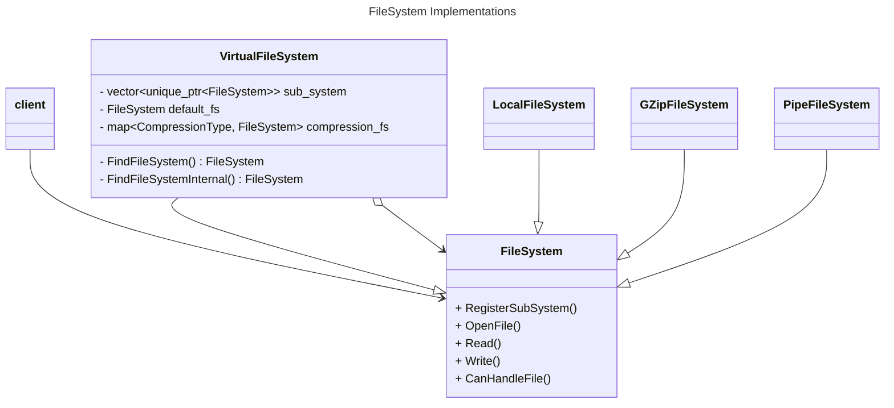
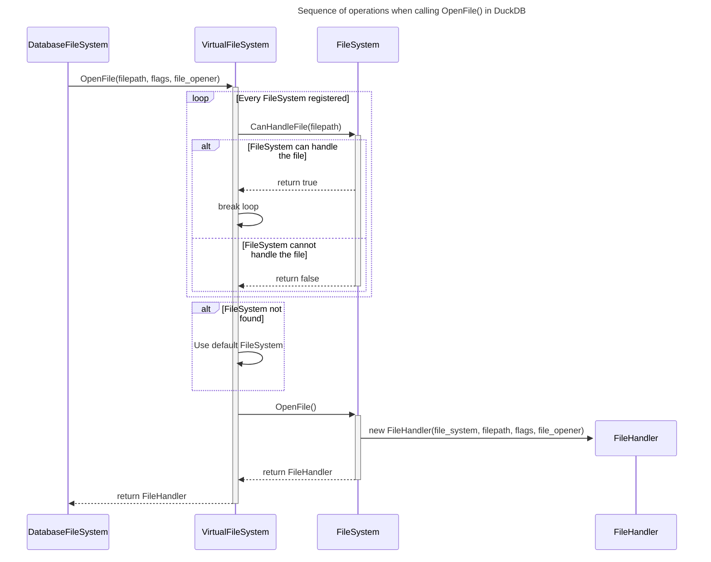
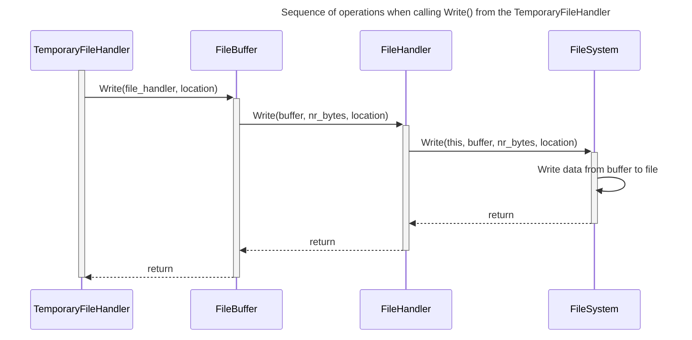
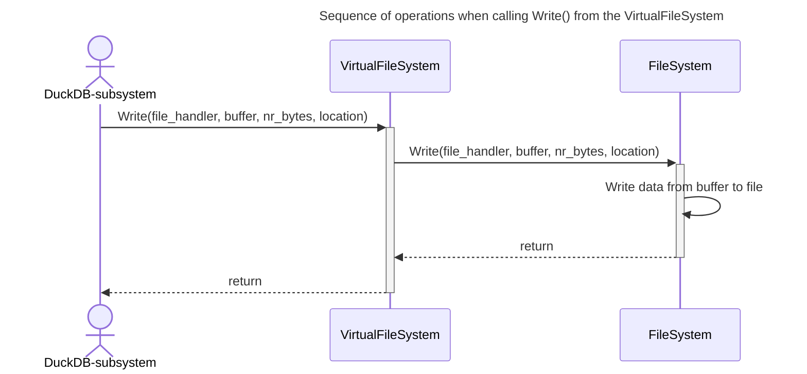

# FileSystem Overview

The filesystem of DuckDb is structured as a composite pattern. 

The `VirtualFileSystem` is composite class that contains the other implementations of `FileSystem`. By using `FindFileSystem()` it iterates through the vector of file systems and call `CanHandleFile()` until the first implementation of `FileSystem` returns `true`.  

DuckDB File system works like the following:

### OpenFile()

#### List of Participants

- **DatabaseFileSystem**: Is responsible for wrapping the `VirtualFileSystem` and provide a context to the opening of files. For that reason the `DatabaseFileSystem` chain of implements is: `DatabaseFileSystem` --> `OpenerFileSystem` --> `FileSystem`. The context is of type `FileOpener` and provides the current settings configured in the database.

### Write()

When calling `Write()` there are different scenarios on how this is being performed. The below diagram shows how the temporary files are being written to using Write()([see here](https://github.com/duckdb/duckdb/blob/19864453f7d0ed095256d848b46e7b8630989bac/src/storage/temporary_file_manager.cpp#L123)). The file handler has already been created, using `OpenFile()` as shown above and is available in this scenario.

Another scenario is when write is being called from the VirtualFileSystem. In this case the `VirtualFileSystem` skips the call to `Write()`on the `FileHandler` but instead calls `Write()` on the `FileSystem`.

